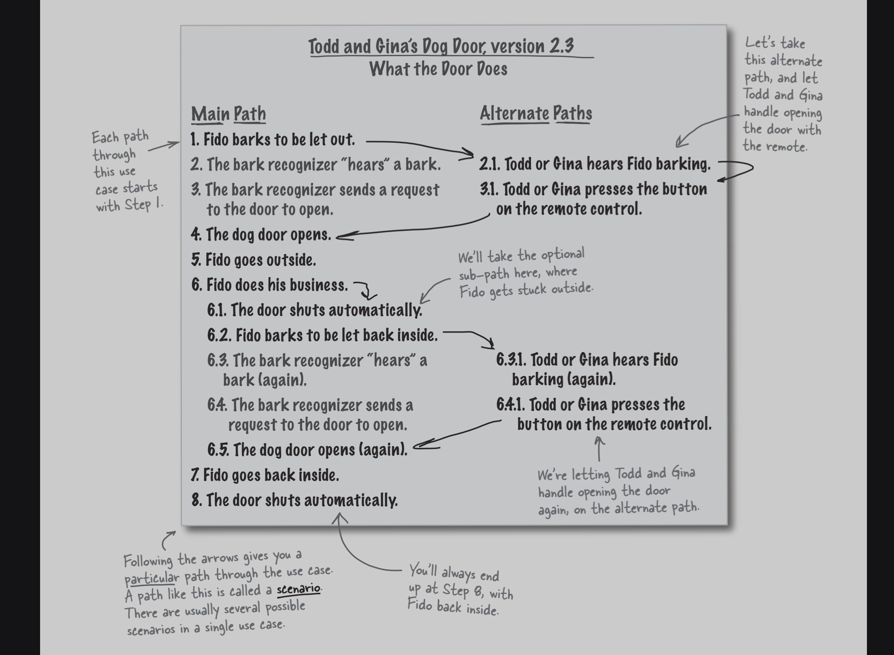

# 🐶 Todd and Gina’s Dog Door (Version 2.3)

## 🎯 Use Case: What the Door Does

---

## 🟢 Main Path

1. Fido barks to be let out  
2. The bark recognizer **hears a bark**  
3. The bark recognizer sends a request to the door to open  
4. The dog door opens  
5. Fido goes outside  
6. Fido does his business  

   6.1 The door shuts automatically  
   6.2 Fido barks to be let back inside  
   6.3 The bark recognizer **hears a bark (again)**  
   6.4 The bark recognizer sends a request to the door to open  
   6.5 The dog door opens (again)  

7. Fido goes back inside  
8. The door shuts automatically  

---

## 🔁 Alternate Paths

### ▶️ Alternate Path A (Manual Open - First Time)

- **2.1** Todd or Gina hears Fido barking  
- **3.1** Todd or Gina presses the button on the remote control  
- System continues at **Step 4 (door opens)**  

---

### ▶️ Alternate Path B (Manual Open - Return)

- **6.3.1** Todd or Gina hears Fido barking (again)  
- **6.4.1** Todd or Gina presses the button on the remote control  
- System continues at **Step 6.5 (door opens again)**  

---

## 🧭 Notes on Flow

- Every path **starts at Step 1**  
- The system always **ends at Step 8** (door closed, Fido inside)  
- Alternate paths allow **manual override using the remote**  
- The bark recognizer handles **automatic operation**  

---

## 💡 Scenario Explanation

- Following different paths creates different **scenarios**  
- A scenario is a **specific path through the use case**  
- Multiple scenarios can exist within a single use case  

---

## ✅ Summary

This version introduces:
- 🧠 Bark recognition (automatic behavior)  
- 🎮 Remote control override (manual behavior)  
- 🔁 Multiple paths for flexibility  

➡️ The system now supports both **automatic** and **manual** door operation.

